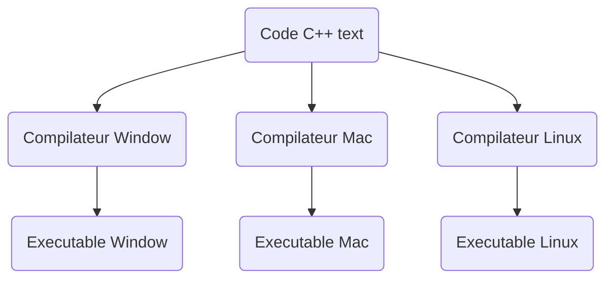
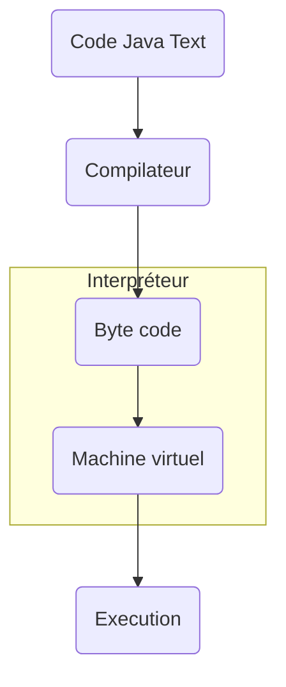
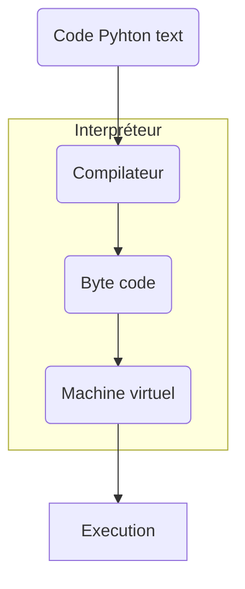

# Compilateur vs Interpréteur 
----
## Compilateur
----
Un compilateur va venir compiler le code en language machine

Exemples:
- GNU compilateur collection (UNIX, Windows, DOS, etc)
- Microsoft visual c++ (Windows)
- Borland c++
- ...

## Compilateur - Interpréteur
----
Version de chacun qui porte des compromis

## Interpréteur
----
Un interpréteur vient abstraire l'execution de la machine virtuelle

## Related Subjects
----
#### flashcard 
----
- Qu'est ce qu'un compilateur ?::Un compilateur va venir compiler le code en language machine
<!--SR:!2024-02-09,7,190-->
- Qu'elle est la limitation d'un compilateur ?::Le compilateur compile le code pour une seul et unique machine
<!--SR:!2024-02-23,21,250-->
- Qu'elle est le processus compilateur ?::Code->Compilateur->Executable
<!--SR:!2024-02-15,17,250-->
- Qu'est ce qu'un interpréteur ?::Un interpréteur vient abstraire l'execution de la machine virtuelle
<!--SR:!2024-02-07,5,170-->
- Qu'elle est le processus de l'interpréteur ?::Code->Interpréteur:(Compilateur->Byte code->Machine virtuel)->Execution
<!--SR:!2024-02-10,8,210-->
- Qu'est ce qu'un compilateur-interpréteur ?::Version mixte du compilateur et de l'interpréteur qui offre quelque possibilité supplémentaire aux profit de compromis
<!--SR:!2024-02-12,10,190-->
- Qu'elle est le processus du compilateur-interpréteur ?::Code->compilateur->Byte code->Interpréteur:(Machine virtuel)->Execution
<!--SR:!2024-02-10,12,230-->