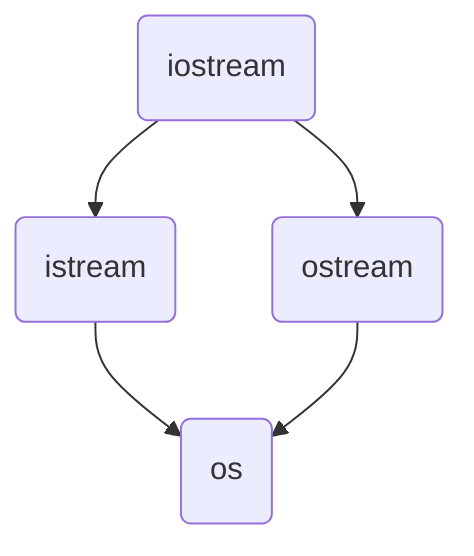

# IOStream
----
Librairie native au C++ pour interagir avec l'extérique du programme
## Class diagram
----


## Commandes
----
```C++
#include <iostream>

using namespace std;

cout << "Hi" << endl // imprime a la console

cin >> var // Prend un seul mots de la consol

char[256] buffer;
cin.getline(buffer, 256) // Prend la ligne au complet
string message = buffer

cin.ignore // ignore le reste du buffer
```

## Related Subjects
----
#### flashcard 
----
- À quoi sert Iostream ?::Librairie native au C++ pour interagir avec l'extérique du programme
<!--SR:!2024-02-06,8,270-->
- Comment afficher a la console en C++ ?:: `cout << "message" << endl`
<!--SR:!2024-02-04,6,270-->
- Comment prendre une seul valeur ou mot dans la console C++ ?:: `cin >> varible`
<!--SR:!2024-02-05,7,270-->
- Comment prendre une ligne complete dans la console?:: `cin.getline(buffer, 255)`
<!--SR:!2024-02-07,9,270-->
- Comment vidé le buffer de `cin` ?::`cin.ignore()`
<!--SR:!2024-02-08,10,270-->