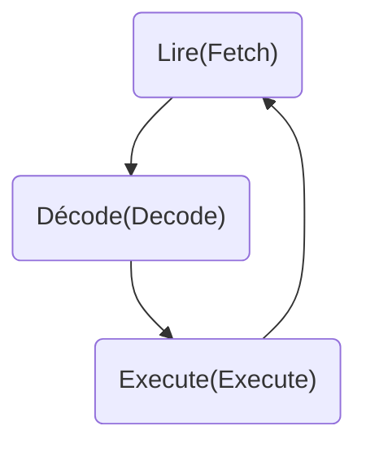

# Microprocesseur 
----
Appeler unité central (CPU), il execute les instruction

## Ce qu'il fait
----
Le microprocesseur fait 3 chose:

**Lire:** Il va chercher la prochaine instruction dans la liste
**Décode:** Détermine ce qu'il doit faire avec l'instruction actuelle
**Execute:** Execute l'instruction reçus
## Related Subjects
----
#### Links
----
- [[Ordinateur]]
#### flashcard 
----
- Qu'est ce qu'un microprocesseur ?::Appeler unité central (CPU), il execute les instruction
<!--SR:!2024-02-08,6,247-->
- Combien a t-il d'étape dans le processus du microprocesseur ?::3
<!--SR:!2024-02-08,6,247-->
- Qu'elle sont les étape du processus du microprocesseur ?::Lire, décode, execute
<!--SR:!2024-02-06,4,247-->
- Qu'est ce que le microprocesseur fait lorsqu'il lit ?::Il va chercher la prochaine instruction dans la liste
<!--SR:!2024-02-07,5,247-->
- Qu'est ce que le microprocesseur fait lorsqu'il décode ?::Détermine ce qu'il doit faire avec l'instruction actuelle
<!--SR:!2024-02-04,2,227-->
- Qu'est ce que le microprocesseur fait lorsqu'il execute ?::Execute l'instruction reçus
<!--SR:!2024-02-07,5,247-->