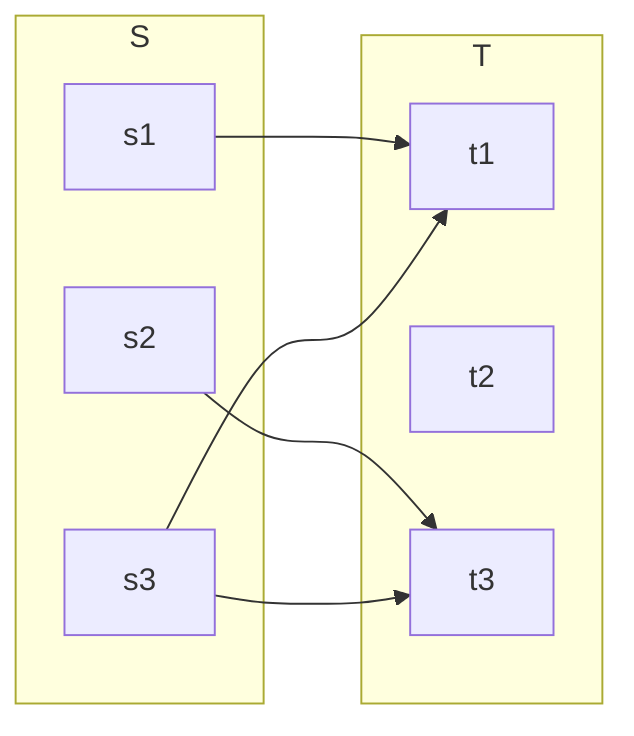
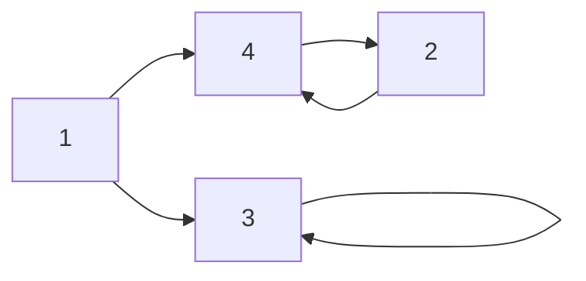

# Relations 
----
Les relation sont des [[Produit cartésien|produit cartésien]] entre 2 ou plus [[Ensemble|ensemble]] qui mettre en relation différent élément de cette ensemble. La relation est représenté par le symbole $\mathcal{R}$

> [!Example] Opérateur plus petit ou éguale
> $$\le : = \{\langle a, b \rangle \in \mathbb{Z}^2 | (b-a) \in \mathbb{N} \}$$

## Notation infixe
----
Notation abrégé d'une relation:
$$a \ \mathcal{R} \ b := \langle a, b \rangle \in \mathcal{R}$$

## Relation vide
----
Relation ou aucun élément est mis en lien:
$$\emptyset \subseteq S \times T \qquad \text{si} \qquad S = \emptyset \lor T = \emptyset$$

## Relation trivial
----
Relation ou tous les élément sont présent:
$$\mathcal{R} = S \times T$$

## Domaine d'une relation
----
Le domaine d'une relation est l'ensemble des premier élément des [[N-tuplet|n-tuplet]] de la relation
$$\text{DOM}(\mathcal{R}) := \{a \in S | (\exists b \in T | a \ \mathcal{R} \ b)\}$$
## Image d'une relation
----
L'image d'une relation est l'ensemble des deuxièmes élément des [[N-tuplet|n-tuplet]] de la relation
$$\text{IMG}(\mathcal{R}) := \{b \in T | (\exists a \in S | a \ \mathcal{R} \ b)\}$$
## Représentation par graphe
----
### Forme bipartie
----
Une relation qui prend la dorme de:
$$\mathcal{R} := \{\langle 1,1 \rangle, \langle 2,3 \rangle, \langle 3,1 \rangle, \langle 3,2 \rangle\}$$
Est représenté comme:

### Forme fusionné
----
Une relation qui prend la dorme de:
$$\mathcal{R} := \{\langle 1,3 \rangle, \langle 3,3 \rangle, \langle 1,4 \rangle, \langle 4,2 \rangle, \langle 2,4 \rangle \}$$
Est représenté comme:

## Related Subjects
----
#### flashcard 
----
- Qu'est ce qu'une relation ?::Les relation sont des [[Produit cartésien|produit cartésien]] entre 2 ou plus [[Ensemble|ensemble]] qui mettre en relation différent élément de cette ensemble
<!--SR:!2024-03-03,1,230-->
- Qu'elle est le symbole utilisé pour décrire une relation ?::$\mathcal{R}$
<!--SR:!2024-03-03,1,230-->
- Qu'elle est la définition de la notation infixe d'une relation ?::$a \ \mathcal{R} \ b := \langle a, b \rangle \in \mathcal{R}$
<!--SR:!2024-03-03,1,230-->
- Qu'est ce qu'une relation vide en notation mathématique ?::$\emptyset \subseteq S \times T \qquad \text{si} \qquad S = \emptyset \lor T = \emptyset$
<!--SR:!2024-03-03,1,230-->
- Qu'est ce qu'une relation trivial en notation mathématique ?:: $\mathcal{R} = S \times T$
<!--SR:!2024-03-03,1,230-->
- Qu'est ce que le domaine d'une relation ?::Le domaine d'une relation est l'ensemble des premier élément des [[N-tuplet|n-tuplet]] de la relation
<!--SR:!2024-03-03,1,230-->
- Qu'est ce que l'image d'une relation ?::L'image d'une relation est l'ensemble des deuxièmes élément des [[N-tuplet|n-tuplet]] de la relation
<!--SR:!2024-03-03,1,230-->
- Comment est définit mathématiquement le domaine d'une relation ?::$\text{DOM}(\mathcal{R}) := \{a \in S | (\exists b \in T | a \ \mathcal{R} \ b)\}$
<!--SR:!2024-03-03,1,230-->
- Comment est définit mathématiquement l'image d'une relation ?::$\text{IMG}(\mathcal{R}) := \{b \in T | (\exists a \in S | a \ \mathcal{R} \ b)\}$
<!--SR:!2024-03-03,1,230-->
- Qu'elle sont les deux type de représentation graphique pour une relation ?::Forme bipartie, Forme fusionné
<!--SR:!2024-03-03,1,230-->