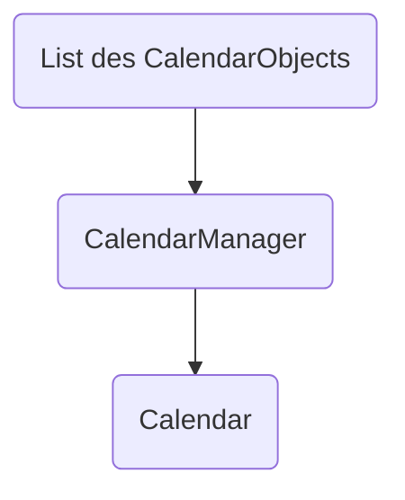

| Nom | Fixe-Time | Movable | Duration | Split able | Recursive |
| ---- | ---- | ---- | ---- | ---- | ---- |
| Event | Oui | Non | Oui | Non | ? |
| TODU | Oui | Oui | Oui | Oui | Non |
| TODO | Non | Oui | Oui | Oui | Non |
| Reminder | Oui | Non | Non | Non | ? |

| par dessus | Event | Event | TODU | TODO | Reminder |
| ---- | ---- | ---- | ---- | ---- | ---- |
| Event | Non | Oui | Non | Non | Oui |
| Event | x | Oui | Non | Non | Oui |
| Todu -> Send warnings if can be place before du date | x | x | Non | Non | Oui |
| Todo | x | x | x | Non | Oui |
| Reminder | x | x | x | x | Oui |

